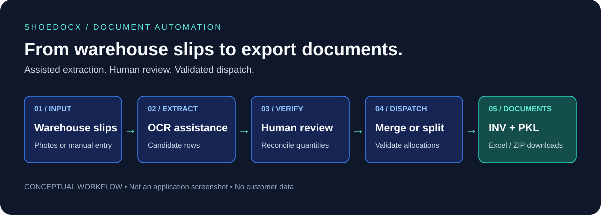
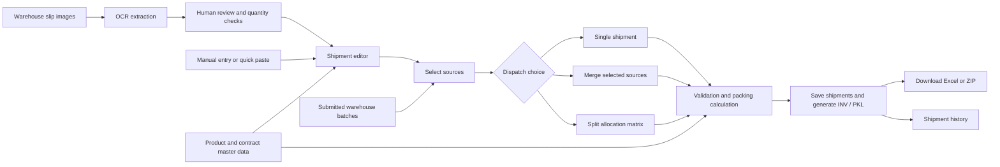
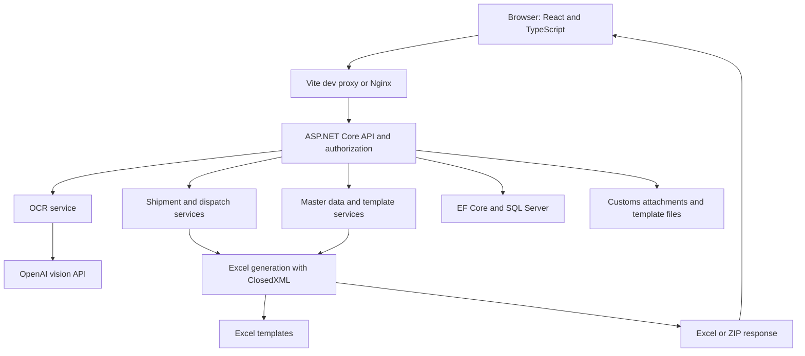

<div align="center">

# ShoeDocX

**From Warehouse Slips to Export Documents — A Smarter, Faster Workflow.**

Invoice & Packing List Automation for Footwear Manufacturing

Turn photographed warehouse slips and manually entered quantities into reviewed shipment data,
Commercial Invoices and Packing Lists. Built for the handoff between warehouse,
export-import and accounting teams, with React and ASP.NET Core.


[Preview](#product-preview) · [Features](#key-features) · [Engineering](#engineering-challenges-and-solutions) · [Run locally](#getting-started) · [Developer](#about-the-developer)

</div>



## Product Preview

The illustration above describes the implemented workflow; it is **not an application screenshot**.
The current interface is primarily Vietnamese and includes an overview, product catalog,
shipment editor, OCR review dialogs, merge preview, split allocation matrix and invoice history.

**Screenshot gallery pending:** authenticated screens have not been captured in a clean demo environment.
See the [capture checklist](docs/assets/README.md) for the required views and privacy checks.

## The Problem

Footwear export documentation crosses several formats: photographed or handwritten warehouse slips,
Excel product lists, Commercial Invoices (INV) and Packing Lists (PKL). Staff must read style codes,
re-enter quantities, reconcile totals, look up prices and carton specifications, then prepare documents.

Small batches may need consolidation; large batches may need several invoices. A correct grand total
alone is insufficient: each style and production process must also balance across the resulting shipments.
Repeated copying and spreadsheet corrections make this handoff difficult to review consistently.

## The Solution

ShoeDocX connects assisted extraction, human review, master data and document preparation in one workflow.
OCR provides a starting point; users review rows and discrepancies before dispatch. The API validates
allocations, applies catalog data and produces template-based Excel files while recording shipments.

| Manual workflow | ShoeDocX workflow |
| --- | --- |
| Read each photo and type every line | Extract candidate rows from images, then review and correct them |
| Look up prices and packing in separate files | Enrich rows from partner/contract master data |
| Recalculate merge/split totals in Excel | Preview merges and validate each style/process allocation |
| Rebuild invoice and packing tables | Generate INV/PKL workbooks from configured templates |
| Track previous exports in scattered files | Find saved shipments, reopen eligible records and re-export |

These mechanisms are intended to reduce repetitive input and improve document preparation consistency.
No measured time savings or customer outcomes are claimed.

## Key Features

| Capability | Implemented behavior |
| --- | --- |
| **OCR-assisted extraction** | Upload or paste images; scan multiple images/documents; normalize style codes; compare extracted and reported totals; review before applying data. Requires an OpenAI key. |
| **Human verification** | Discrepancy indicators and reasoned manual confirmation with audit records. Confirmation does not supply missing master data or remove other export checks. |
| **Invoice & packing automation** | Document and packing previews, product-specific pairs per carton, full/partial carton breakdowns, carton ranges and weight formulas; template-based INV/PKL Excel output. |
| **Shipment merge & split** | Merge selected sources under a compatible contract; allocate into 2–10 logical invoices; validate per-style/process quantities and totals; reserve document numbers; download Excel or ZIP output. |
| **Master data** | Product codes/descriptions, prices, process-specific values and packing specifications; partner/contract folders; Excel import preview, row-level errors and export. |
| **History & working drafts** | Load saved shipments, edit eligible records and re-export. Browser drafts retain unfinished work and check server changes before overwriting; drafts stay on the current browser. |
| **Access & traceability** | Identity-backed login, cookie JWT, departmental API permissions, warehouse handoff, cleared-record edit/delete guards, shipment-source relations and business audits. |

**Dispatch detail:** standard and GoKhongMay production processes remain separate. A merge can produce
multiple workbooks, and a logical split can create additional physical documents when it contains both processes.
Auto-balancing currently prefers **12 pairs per carton**; final document packing uses product master data.

Additional implemented modules cover customs-file comparison and archiving, accounting settlement,
BOM calculation, materials and production planning. See the [feature evidence and limitations](docs/FEATURES.md).

## How It Works



## Technology Stack

Versions below describe the checked-in manifests, rather than a claim to use the latest releases.

| Layer | Technology |
| --- | --- |
| API & identity | ASP.NET Core / .NET 8, ASP.NET Core Identity, JWT bearer authentication |
| Persistence | Entity Framework Core 8, SQL Server; SQLite for isolated backend tests |
| Web application | React 19, TypeScript 6, Vite 8, Ant Design 6, Tailwind CSS 3, Axios |
| Spreadsheet processing | ClosedXML 0.104.2, Open XML, ExcelDataReader 3.9 |
| Vision extraction | OpenAI integration; model and endpoint are configurable |
| Containers | Docker Compose, multi-stage builds, Nginx API proxy |
| Automated checks | xUnit, Microsoft.NET.Test.Sdk, coverlet collector; Node test runner for drafts |

## System Architecture



The browser handles editing and review; the API enforces business rules, authorization and persistence.
Images are sent to the configured OCR provider. SQL Server stores business records, while templates and
customs attachments use filesystem storage. Excel/ZIP downloads are generated by backend services.
See [architecture and template details](docs/ARCHITECTURE.md).

## Engineering Challenges and Solutions

| Challenge | Technical approach | Result in the implementation |
| --- | --- | --- |
| Multiple tables or batches in one photograph | Parse separate documents, retain source identifiers, normalize codes and reconcile each document | Users select and review individual documents instead of accepting one flattened total |
| OCR quantities disagree with the slip | Compare reported and calculated totals; expose discrepancies and audit explicit confirmation | Mismatches remain visible and merge reconciliation can block export |
| Split totals match but individual products do not | Rebuild source quantities and compare allocations by normalized style **and process**, plus the grand total | Overallocating one product cannot compensate for underallocating another |
| Numbering and persisted exports must stay together | Use sequence reservations, serializable dispatch transactions, retry execution and rollback on failure | Dispatch numbering, shipment records and source status updates share a transaction boundary |
| Existing Excel layouts must remain useful | Load templates, use configurable cell mappings, extend rows and write totals/formulas; remove stamps/drawings | Documents retain template-based structure without promising complete visual preservation |
| Work is interrupted or a saved shipment changes | Store drafts by user/backend; compare server baseline; retain edits made during delayed saves | Drafts survive interruptions and conflicting server changes can block overwrites |

The [audit](docs/AUDIT.md) identifies the implementation evidence. These mechanisms do not establish
production performance or independent security certification.

## Getting Started

**Prerequisites:** Git, Docker with Compose, and a reachable SQL Server instance.
Compose starts the web/API containers; it does **not** provision SQL Server.

```bash
git clone https://github.com/Nhutduyasda/ShoeDocX.git
cd ShoeDocX
cp .env.example .env
```

On PowerShell, use `Copy-Item .env.example .env`. In `.env`, configure:

- `SQLSERVER_CONNECTION_STRING` for your own development database.
- `JWT_KEY` with a random secret of at least 32 bytes.
- `WEB_PORT=5173` for the local URL below.
- `OPENAI_API_KEY` with your key, or leave it empty for manual entry without OCR.
- For first administrator creation, set `BOOTSTRAP_ADMIN_ENABLED=true` and supply a unique username
  and strong password. Disable bootstrap after creation and recreate the backend container.

```bash
docker compose up -d --build
```

Open [http://localhost:5173](http://localhost:5173). The API is at
[http://localhost:5270/api](http://localhost:5270/api) (a route prefix, not a landing page).
Swagger is available only when the API runs in Development mode.

For native development, use .NET 8 and Node 22.12+; see [SETUP.md](docs/SETUP.md) for secrets,
administrator setup, storage, OCR configuration and known container limitations.
Instructions were checked against configuration; a complete local stack was not started during this audit.

## Testing & Quality

```bash
dotnet test tests/ShoeExportInvoice.Tests/ShoeExportInvoice.Tests.csproj
cd frontend
npm run test:drafts
npm run build
```

Backend test sources cover packing, OCR parsing/reconciliation, dispatch allocations, Excel import,
authorization, tenant filtering, customs workflows, BOM and save retries. Many use SQLite or test doubles;
they do not establish SQL Server integration or live vision-provider accuracy.
Frontend automated tests focus on draft persistence and conflict handling; broader UI checks are manual.

See [validation results](docs/VALIDATION.md) for actual execution outcomes and remaining gaps.
Coverage tooling is present, but no measured coverage percentage is claimed.

## Project Status & Roadmap

**Available in source:** document generation, reviewed OCR, merge/split UI and API, source traceability,
history, master data and departmental access controls.

**Partial / experimental:** 12-pair split auto-balancing despite configurable final packing;
AI-assisted template mapping with demo credits. Arbitrary-template reliability and commercial billing are unverified.

**Planned or awaiting verification:** quantity-threshold merge/split suggestions from the dispatch roadmap,
privacy-safe screenshots, real-image browser acceptance tests and complete SQL Server/container verification.
No production deployment URL or customer acceptance evidence was established in this audit.

The [original dispatch roadmap](ROADMAP_SHIPMENT_DISPATCH_RULES.md) preserves business requirements.
Its historical labels and proposed API names should be read alongside the [current feature matrix](docs/FEATURES.md).

## About the Developer

**Duy Nguyen** builds practical software for business workflows. ShoeDocX presents work across
.NET APIs, React interfaces, spreadsheet automation and the validation needed to connect operational data
with export documents.

[GitHub](https://github.com/Nhutduyasda) · [Portfolio](https://duy-works.vercel.app/) ·
[LinkedIn](https://www.linkedin.com/in/nhut-duy-nguyen-67a0673b9/)

## Contact & Collaboration

For custom business web applications, Excel/document automation, OCR-assisted workflows,
.NET / React development or integration improvements, connect with Duy through the profiles above.

## License

No license file was found at the audited baseline. The earlier README described internal business use.
Public visibility does not establish an open-source license; contact the owner about reuse or licensing terms.
